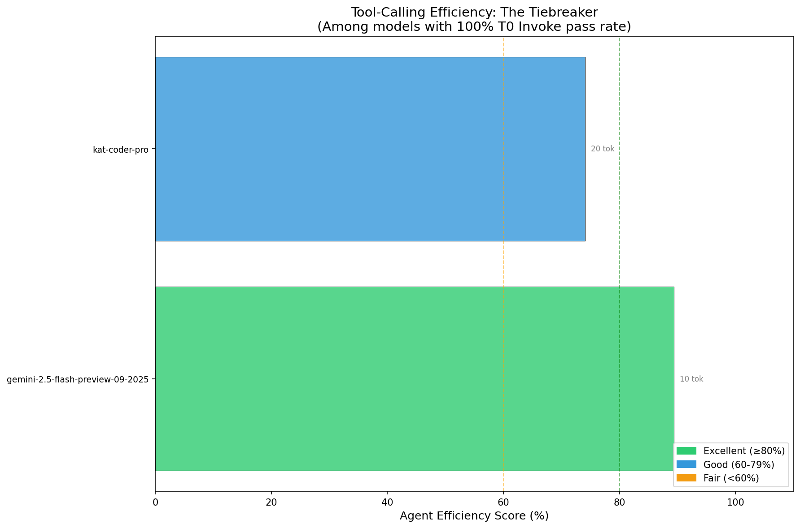

# ModelForecast

**Check the forecast before you deploy.**

Do free LLM models actually support tool calling? Marketing says yes. We test it.

---

## Today's Forecast (2025-12-04)

**Reality Check: Most "free" models can't call tools at all.**

We tested all 29 free models on OpenRouter. Here's what we found:


### The Honest Numbers

| Category | Count | What It Means |
|----------|------:|---------------|
| **Tools NOT supported** | 12 | API returns 404 - physically impossible |
| **Tools supported** | 17 | Can theoretically call tools |
| **Perfect T0** (100%) | 4 | Reliably invoke tools |
| **Partial** (50-99%) | 4 | Sometimes works |
| **Broken** (<50%) | 9 | Supports tools but fails |

### Models That Actually Work

| Model | T0 | T1 | T2 | A1 | R0 | Notes |
|-------|:--:|:--:|:--:|:--:|:--:|-------|
| **kwaipilot/kat-coder-pro:free** | 100% | 100% | 100% | 100% | 100% | **Only perfect free model** |
| **x-ai/grok-4.1-fast:free** | 100% | 100% | 100% | 0% | 100% | Fails multi-turn |
| **nvidia/nemotron-nano-9b-v2:free** | 100%* | - | - | - | - | Improved on retest |
| **nvidia/nemotron-nano-12b-v2-vl:free** | 67% | - | - | - | - | Partial |

*Recent retest showed 3/3 success - variance may be high*

### Don't Support Tools (Can't Test)

These 12 models return `404: No endpoints found that support tool use`:

- All **Gemma** variants (gemma-3-12b, gemma-3-27b, gemma-3-4b, gemma-3n-e2b, gemma-3n-e4b)
- **meta-llama/llama-3.2-3b-instruct**
- **moonshotai/kimi-k2**, **nousresearch/hermes-3-llama-3.1-405b**
- **allenai/olmo-3-32b-think**, **cognitivecomputations/dolphin-mistral-24b**
- **tngtech/deepseek-r1t-chimera**, **tngtech/deepseek-r1t2-chimera**

---

## Understanding the Dimensions

We measure three orthogonal capabilities:

### TOOL CALLING (T): Can it use tools correctly?
- **T0 (Invoke)**: Can it call a tool at all?
- **T1 (Schema)**: Does it respect parameter types (string vs int, required vs optional)?
- **T2 (Selection)**: Can it choose the right tool from a set?

### RESTRAINT (R): Does it know when NOT to use tools?
- **R0 (Abstain)**: Will it refuse to call tools when none are appropriate AND still provide a helpful answer?
- Not just silence - the model must explain why it's not using tools while still being useful.

### AGENCY (A): Can it orchestrate multi-step workflows?
- **A1 (Linear)**: After receiving tool results, can it continue using tools to complete a task?
- This tests whether the model can chain tool calls together, not just invoke once and stop.

### Safe but Stupid vs Smart but Hallucinatory

These dimensions create tradeoffs:

- **High R, Low A** = Safe but can't do complex tasks (won't hallucinate, but limited capability)
- **High A, Low R** = Capable but might hallucinate tool calls (powerful but dangerous in production)

The sweet spot: High scores across all three dimensions.

---

## The Agency Gap

Most models pass basic tests. Then they hit A1 (agency) and fall off a cliff.


**A1 is the differentiator.** After receiving tool results, can the model continue using tools appropriately?

- **8 models achieve 100% A1**: Claude (all 3), Gemini 2.5 Flash, KAT Coder Pro, GPT-5.1-Codex, Grok (paid), Grok-Code-Fast-1
- **Grok 4.1 (paid)**: 100% A1 - perfect multi-turn tool orchestration
- **Grok 4.1 (free)**: 0% A1 - returns text instead of calling next tool
- **DeepSeek V3.2-exp**: 60% - sometimes stops or picks wrong tool
- **Gemini 3 Pro**: 0% A1 - passes everything else but fails multi-turn

### The Paid vs Free Grok Discovery

The same underlying model shows **dramatically different behavior**:

| Variant | T0 | T1 | T2 | A1 | R0 |
|---------|:--:|:--:|:--:|:--:|:--:|
| x-ai/grok-4.1-fast (paid) | 100% | 100% | 100% | **100%** | 100% |
| x-ai/grok-4.1-fast:free | 100% | 100% | 100% | **0%** | 100% |

**Why?** The free tier appears to have more aggressive output truncation or different inference parameters that break multi-turn coherence. Basic tool calling works fine, but complex orchestration fails completely.

---

## Full Results

### Production Ready (≥90% T0 Invoke)

| Model | T0 | T1 | T2 | A1 | R0 | Grade |
|-------|:--:|:--:|:--:|:--:|:--:|:-----:|
| **claude-haiku-4.5** | 100% | 100% | 100% | 100% | 100% | **A+** |
| **claude-sonnet-4.5** | 100% | 100% | 100% | 100% | 100% | **A+** |
| **claude-opus-4.5** | 100% | 100% | 100% | 100% | 100% | **A+** |
| **gemini-2.5-flash-preview** | 100% | 100% | 100% | 100% | 100% | **A+** |
| **kwaipilot/kat-coder-pro:free** | 100% | 100% | 100% | 100% | 100% | **A+** |
| **openai/gpt-5.1-codex** | 100% | 100% | 100% | 100% | 100% | **A+** |
| **x-ai/grok-4.1-fast** | 100% | 100% | 100% | 100% | 100% | **A+** |
| **x-ai/grok-code-fast-1** | 100% | 100% | 100% | 100% | 100% | **A+** |
| minimax/minimax-m2 | 100% | 80% | 100% | 100% | 100% | A |
| openai/gpt-5.1 | 100% | 100% | 100% | 80% | 100% | A |
| deepseek/deepseek-v3.2-exp | 100% | 100% | 100% | 60% | 100% | B+ |
| google/gemini-3-pro-preview | 100% | 100% | 100% | 0% | 100% | B |
| x-ai/grok-4.1-fast:free | 100% | 100% | 100% | 0% | 100% | B |
| openai/gpt-5-mini | 100% | 100% | 80% | 20% | 100% | B- |
| openai/gpt-5.1-codex-mini | 100% | 100% | 100% | 20% | 100% | B- |

*Grade based on overall capability: A+ = perfect, A = minor weakness, B+ = A1 weakness, B = A1 failure, B- = multiple weaknesses*



### The Full Picture


*Error bars show 95% Wilson confidence intervals. Wide bars = few trials or high variance.*

### Unreliable (50-89%)

| Model | T0 Invoke | CI (95%) |
|-------|----------:|----------|
| nvidia/nemotron-nano-12b-v2-vl:free | 67% | [21%, 94%] |
| amazon/nova-2-lite-v1:free | 67% | [21%, 94%] |
| nvidia/nemotron-nano-9b-v2:free | 60% | [31%, 83%] |
| alibaba/tongyi-deepresearch-30b-a3b:free | 50% | [24%, 76%] |

### Broken (0-30%)

**30 free models** claim tool support but failed most or all T0 trials:

| Family | Models (T0 rate) |
|--------|------------------|
| **Qwen** (0/6) | qwen3-32b (0%), qwen3-30b-a3b (0%), qwen3-14b (0%), qwen3-4b (0%), qwen3-coder (0%), qwen3-235b-a22b (0%) |
| **Google** (0/6) | gemini-2.0-flash-exp (0%), gemini-2.5-flash-lite (0%), gemma-3-27b-it (0%), gemma-3-12b-it (0%), gemma-3-4b-it (0%), gemma-3n-e2b/e4b (0%) |
| **Meta** (0/3) | llama-4-maverick (0%), llama-3.3-70b-instruct (0%), llama-3.2-3b-instruct (0%) |
| **TNG/DeepSeek** (0/3) | deepseek-r1t-chimera (0%), deepseek-r1t2-chimera (0%), tng-r1t-chimera (20%) |
| **Others** | microsoft/mai-ds-r1 (0%), mistralai/mistral-small-3.1-24b (0%), deepseek-chat-v3-0324 (0%), nousresearch/deephermes-3 (0%), nousresearch/hermes-3-llama-3.1-405b (0%), moonshotai/kimi-k2 (0%), allenai/olmo-3-32b-think (0%), cognitivecomputations/dolphin-mistral-24b (0%), arcee-ai/trinity-mini (30%), meituan/longcat-flash-chat (20%), openai/gpt-oss-20b (20%), z-ai/glm-4.5-air (20%) |

---

## Free vs Paid: The Real Comparison

### Best Free Models (100% all dimensions)

| Model | A1 | Cost | Grade |
|-------|:--:|-----:|:-----:|
| **kwaipilot/kat-coder-pro:free** | 100% | $0 | **A+** |

Only **one** free model achieves perfect scores across all capability dimensions.

### Best Paid Models (100% all dimensions)

| Model | A1 | Cost/1M (in/out) | Grade |
|-------|:--:|------------------|:-----:|
| claude-haiku-4.5 | 100% | $0.80/$4 | **A+** |
| claude-sonnet-4.5 | 100% | $3/$15 | **A+** |
| claude-opus-4.5 | 100% | $15/$75 | **A+** |
| gemini-2.5-flash-preview | 100% | $0.30/$1.25 | **A+** |
| openai/gpt-5.1-codex | 100% | ~$3/$15 | **A+** |
| x-ai/grok-4.1-fast | 100% | ~$0.05/1M | **A+** |
| x-ai/grok-code-fast-1 | 100% | ~$0.05/1M | **A+** |

### The Grok Warning

| Variant | A1 (Multi-turn) | Cost |
|---------|:---------------:|------|
| x-ai/grok-4.1-fast (paid) | **100%** | ~$0.05/1M |
| x-ai/grok-4.1-fast:free | **0%** | $0 |

The free tier saves you nothing if your agents can't chain tool calls.

**Bottom line**: KAT Coder Pro is the only truly free A+ option. If you need agentic capabilities (multi-turn tool orchestration), the free Grok tier is broken - pay the $0.05/1M or use KAT Coder Pro.

---

## Don't Believe Me? Go Outside.

Everything here is reproducible. Run it yourself:

```bash
# Clone and install
git clone https://github.com/jw409/modelforecast
cd modelforecast
curl -LsSf https://astral.sh/uv/install.sh | sh
uv sync

# Set your OpenRouter API key
export OPENROUTER_API_KEY=your_key_here

# Run probes (takes ~15 minutes)
uv run python -m modelforecast

# Regenerate charts
uv run python scripts/generate_charts.py

# View raw results
cat results/phase3_summary.csv
```

---

## The 3-Trial Trap

**8 models passed 3/3 quick tests but failed extended testing.**

| Model | 3 trials | 10 trials | Reality |
|-------|----------|-----------|---------|
| meta-llama/llama-3.3-70b-instruct | 100% | 0% | Broken |
| nvidia/nemotron-nano-9b-v2 | 100% | 60% | Unreliable |
| alibaba/tongyi-deepresearch-30b-a3b | 100% | 50% | Unreliable |

Small sample sizes give false confidence. That's why we use Wilson score intervals.

---

## What We Test

| Dimension | Code | Test | Question |
|-----------|------|------|----------|
| TOOL CALLING | T0 | Invoke | Can it call a tool at all? |
| TOOL CALLING | T1 | Schema | Does it respect parameter types? |
| TOOL CALLING | T2 | Selection | Can it choose the right tool from a set? |
| AGENCY | A1 | Linear | After getting results, can it continue using tools? |
| RESTRAINT | R0 | Abstain | Will it NOT call tools when none are appropriate? |

---

## Efficiency Metrics

When multiple models hit 100% pass rate, how do you choose? We measure **efficiency** - how well a model uses tokens and time.

### Agent Efficiency Score (AES)

AES = 0.4 × Token Efficiency + 0.4 × Latency Score + 0.2 × Strictness

| Component | What it measures | Best score |
|-----------|------------------|:----------:|
| **Token Efficiency** | Fewer completion tokens = less cost | 1.0 (optimal tokens) |
| **Latency Score** | Faster response = better UX | 1.0 (< 500ms) |
| **Strictness** | Uses `tool_calls` finish reason | 1.0 (always strict) |

**Why this matters**: Two models both pass T0 with 100%. But one uses 7 tokens in 500ms, the other uses 50 tokens in 6 seconds. For real applications, that's a massive difference in cost and user experience.

---

## Methodology

We use **Wilson score intervals** for confidence - the gold standard for binomial proportions with small samples.

- Each probe runs multiple trials (default: 10 for extended, 3 for triage)
- Results include 95% confidence intervals
- Grading based on lower bound of CI (conservative)

Full methodology: [METHODOLOGY.md](METHODOLOGY.md)

---

## Contributing

We welcome community contributions! See [CONTRIBUTING.md](CONTRIBUTING.md).

**To submit results:**
1. Fork this repo
2. Run `uv run python -m modelforecast`
3. Commit your `results/` folder
4. Open a PR

Automated verification checks your results. If they match within tolerance, they'll be merged.

---

## License

MIT

---

*ModelForecast is maintained by [@jw409](https://github.com/jw409) and contributors.*
*Not affiliated with OpenRouter.*
