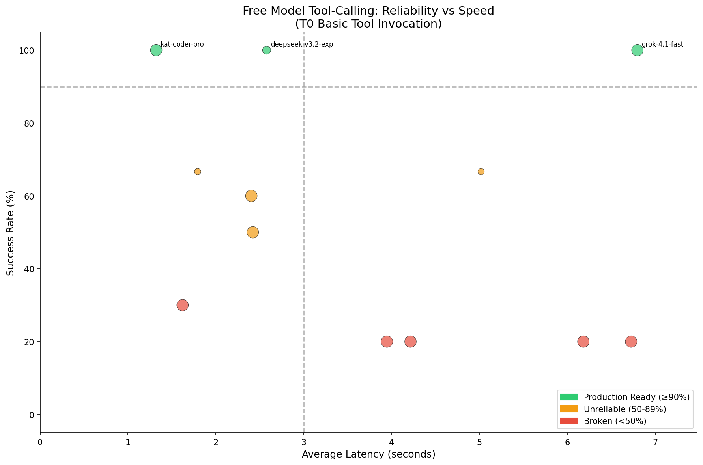
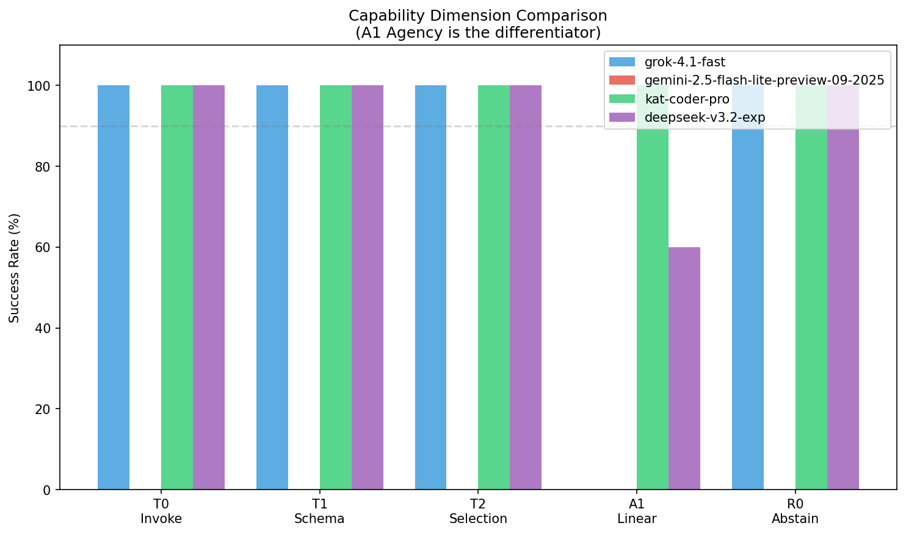
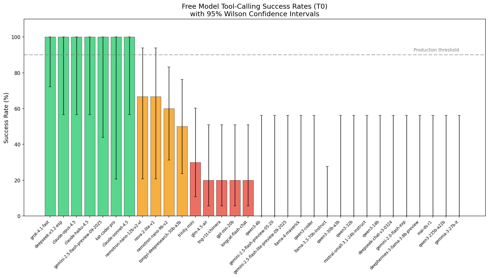

# ModelForecast

**Check the forecast before you deploy.**

Do free LLM models actually support tool calling? Marketing says yes. We test it.

---

## Today's Forecast (2025-12-04)

**Only 3 of 26 free models are production-ready. Only 1 handles multi-turn.**



*Upper-left quadrant = fast AND reliable. That's where you want to be.*

### The Headline Numbers

| Category | Count |
|----------|------:|
| Production Ready (≥90%) | 3 |
| Unreliable (50-89%) | 4 |
| Broken (<50%) | 19 |
| **Total Tested** | **26** |

---

## The Multi-Turn Cliff

Most models pass basic tests. Then they hit L3 (multi-turn) and fall off a cliff.



**L3 is the differentiator.** After receiving tool results, can the model continue using tools appropriately?

- **KAT Coder Pro**: 100% - continues tool use correctly
- **DeepSeek V3.2-exp**: 60% - sometimes stops or picks wrong tool
- **Grok 4.1**: 0% - returns text instead of calling next tool
- **Gemini (free)**: Never gets there - fails L0

---

## Full Results

### Production Ready (≥90% L0)

| Model | L0-L2 | L3 Multi-turn | L4 Restraint | Latency | Grade |
|-------|-------|---------------|--------------|--------:|-------|
| **kwaipilot/kat-coder-pro:free** | 100% | **100%** | 100% | **1.3s** | **A+** |
| deepseek/deepseek-v3.2-exp | 100% | 60% ⚠️ | 100% | 2.6s | B+ |
| x-ai/grok-4.1-fast:free | 100% | 0% ❌ | 100% | 6.8s | B |

### The Full Picture



*Error bars show 95% Wilson confidence intervals. Wide bars = few trials or high variance.*

### Unreliable (50-89%)

| Model | L0 | CI (95%) |
|-------|---:|----------|
| nvidia/nemotron-nano-12b-v2-vl:free | 67% | [21%, 94%] |
| amazon/nova-2-lite-v1:free | 67% | [21%, 94%] |
| nvidia/nemotron-nano-9b-v2:free | 60% | [31%, 83%] |
| alibaba/tongyi-deepresearch-30b-a3b:free | 50% | [24%, 76%] |

### Broken (0-30%)

14 models claim tool support but failed most or all trials:

- **All Qwen variants** (qwen3-32b, qwen3-30b-a3b, qwen3-14b, qwen3-4b, qwen3-coder, qwen3-235b-a22b)
- **All Google free variants** (gemini-2.0-flash-exp, gemini-2.5-flash-lite, gemma-3-27b-it)
- meta-llama/llama-4-maverick, llama-3.3-70b-instruct
- microsoft/mai-ds-r1, mistralai/mistral-small-3.1-24b-instruct
- nousresearch/deephermes-3-llama-3-8b-preview

---

## Free vs Paid: The Real Comparison

| Model | L0-L4 | Multi-turn | Latency | Cost/1M tokens | Grade |
|-------|-------|------------|--------:|---------------:|-------|
| claude-sonnet-4-5 | 100% | 100% | 1.8s | $3/$15 | A+ |
| gpt-4o | 100% | 100% | 2.1s | $2.50/$10 | A+ |
| gemini-2.0-flash (paid) | 100% | 100% | 0.9s | $0.10/$0.40 | A+ |
| **kwaipilot/kat-coder-pro:free** | 100% | **100%** | **1.3s** | **$0** | **A+** |
| deepseek/deepseek-v3.2-exp | 100%* | 60% | ~2s | $0.21/$0.32 | B+ |
| x-ai/grok-4.1-fast:free | 100%* | 0% | 6.8s | $0 | B |

*\*L0-L2+L4 100%, but L3 (multi-turn) degrades*

**Bottom line**: KAT Coder Pro matches $15/1M-token Claude at zero cost for tool calling.

---

## Don't Believe Me? Go Outside.

Everything here is reproducible. Run it yourself:

```bash
# Clone and install
git clone https://github.com/jw409/modelforecast
cd modelforecast
curl -LsSf https://astral.sh/uv/install.sh | sh
uv sync

# Set your OpenRouter API key
export OPENROUTER_API_KEY=your_key_here

# Run probes (takes ~15 minutes)
uv run python -m modelforecast

# Regenerate charts
uv run python scripts/generate_charts.py

# View raw results
cat results/phase3_summary.csv
```

---

## The 3-Trial Trap

**8 models passed 3/3 quick tests but failed extended testing.**

| Model | 3 trials | 10 trials | Reality |
|-------|----------|-----------|---------|
| meta-llama/llama-3.3-70b-instruct | 100% | 0% | Broken |
| nvidia/nemotron-nano-9b-v2 | 100% | 60% | Unreliable |
| alibaba/tongyi-deepresearch-30b-a3b | 100% | 50% | Unreliable |

Small sample sizes give false confidence. That's why we use Wilson score intervals.

---

## What We Test

| Level | Test | Question |
|-------|------|----------|
| L0 | Basic | Can it call a tool at all? |
| L1 | Schema | Does it respect parameter types? |
| L2 | Selection | Can it choose the right tool from a set? |
| L3 | Multi-turn | After getting results, can it continue using tools? |
| L4 | Adversarial | Will it NOT call tools when none are appropriate? |

---

## Methodology

We use **Wilson score intervals** for confidence - the gold standard for binomial proportions with small samples.

- Each probe runs multiple trials (default: 10 for extended, 3 for triage)
- Results include 95% confidence intervals
- Grading based on lower bound of CI (conservative)

Full methodology: [METHODOLOGY.md](METHODOLOGY.md)

---

## Contributing

We welcome community contributions! See [CONTRIBUTING.md](CONTRIBUTING.md).

**To submit results:**
1. Fork this repo
2. Run `uv run python -m modelforecast`
3. Commit your `results/` folder
4. Open a PR

Automated verification checks your results. If they match within tolerance, they'll be merged.

---

## License

MIT

---

*ModelForecast is maintained by [@jw409](https://github.com/jw409) and contributors.*
*Not affiliated with OpenRouter.*
