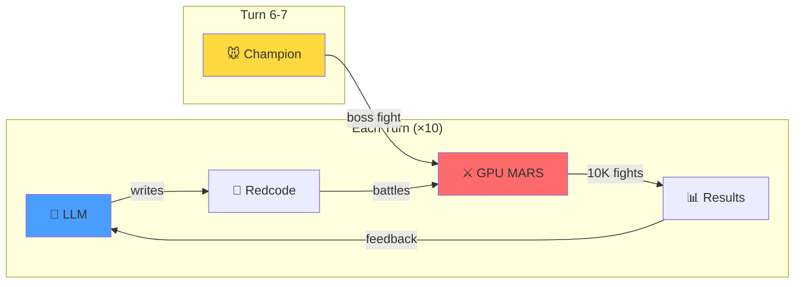

# ModelForecast

We built a GPU colosseum. LLMs wrote [Redcode](https://corewar.co.uk/icws94.txt). They competed. A **free model** tied the best paid model.

Welcome to ModelForecast: **a benchmark suite that tests whether LLMs can learn and adapt under adversarial pressure.**

Static benchmarks ask "can you do X?" once. We run 10 rounds with 10,000 battles each. Your code fights. You watch. You iterate. Or you die.

---

## The Colosseum


```mermaid
flowchart LR
    subgraph Turn["Each Turn (×10)"]
        A[🤖 LLM] -->|writes| B[📝 Redcode]
        B -->|battles| C[⚔️ GPU MARS]
        C -->|10K fights| D[📊 Results]
        D -->|feedback| A
    end

    subgraph Surprise["Turn 6-7"]
        E[🐭 Champion]
        E -->|boss fight| C
    end

    style A fill:#4a9eff
    style C fill:#ff6b6b
    style E fill:#ffd93d
```

**CoreWars**: Assembly gladiators fight for control of shared memory. Kill your opponent's processes or die trying.

Each model starts with a basic IMP (`MOV 0, 1`). They watch 10,000 battles. They write improved code. They repeat for 10 turns. At Turn 6, a surprise champion appears.

**The Results:**

| Rank | Model | Win Rate | Improvement | Cost |
|:----:|-------|:--------:|:-----------:|:----:|
| 🥇 | **KAT Coder Pro** | 36.0% | +19.0% | FREE |
| 🥇 | GPT-4o Mini | 36.0% | +19.2% | $0.15/1M |
| 🥉 | Gemini Flash | 33.0% | +10.6% | $0.075/1M |
| 4 | DeepSeek V3 | 27.8% | +11.3% | $0.14/1M |
| — | GLM 4.5 Air | — | — | FREE |
| — | Claude Haiku | — | — | $0.25/1M |

The free model tied the champion.

---

## The Drama

### 🐙 KAT Coder Pro: Zero-Dollar Champion

Turn 1: Basic IMP. 16.6% win rate.
Turn 10: Multi-process bomber with imp gates. 36.0% win rate.

**+19% improvement. Zero cost.** A model you've never heard of, available for free, matched the best paid model on the market.

### 🐭 The Boss Fight

Turn 6-7: Surprise champion. Everyone faces Mice.red—a self-replicating nightmare:

```asm
; Mice - Self-replicating warrior
    ptr     DAT #0
    start   MOV #12, count
    loop    MOV @ptr, <dest
            DJN loop, count
            SPL @dest
            ADD #653, ptr
            JMZ start, ptr
    count   DAT #0
    dest    DAT #833
```

Win rates dropped 5-15%. The real benchmark isn't the average case. It's whether you can handle the boss.

---

<div align="center">

## **[🎮 WATCH THE BATTLES LIVE →](https://jw409.github.io/modelforecast/corewars/)**

**8,192 battles. Real-time visualization. See which LLM dominates.**

</div>

---

- **27,845 battles/sec** on GPU (RTX 5090)
- Full tournament playback with leaderboard
- Every battle recorded and replayable

---

## Why Games Beat Benchmarks

Static benchmarks ask: "Can you call a function?"

Game benchmarks ask:
- **Learning**: Did performance improve over time?
- **Adversarial pressure**: Can you handle surprise opponents?
- **Real stakes**: Wrong moves = immediate loss

One measures capability. The other measures adaptation.

---

## Tool-Calling Benchmark

Separate from tournaments, we test whether models can use tools reliably. Five probes: basic calls (T0), schema compliance (T1), tool selection (T2), multi-turn chaining (A1), and knowing when NOT to call tools (R0).

60+ models tested across 25+ providers. Wilson score intervals. 5-10 trials per test. Updated Feb 2026.

### Perfect Score (A+)

| Model | T0 | T1 | T2 | A1 | R0 | Cost |
|-------|:--:|:--:|:--:|:--:|:--:|:----:|
| anthropic/claude-haiku-4.5 | 100% | 100% | 100% | 100% | 100% | $0.80/M |
| anthropic/claude-sonnet-4.5 | 100% | 100% | 100% | 100% | 100% | $3/M |
| anthropic/claude-opus-4.5 | 100% | 100% | 100% | 100% | 100% | $15/M |
| deepseek/deepseek-v3.2-exp | 100% | 100% | 100% | 100% | 100% | $1.10/M |
| google/gemini-2.5-flash-preview | 100% | 100% | 100% | 100% | 100% | $0.15/M |
| kwaipilot/kat-coder-pro:free | 100% | 100% | 100% | 100% | 100% | FREE* |
| **nvidia/nemotron-3-nano-30b-a3b:free** | 100% | 100% | 100% | 100% | 100% | **FREE** |
| openai/gpt-5.1-codex | 100% | 100% | 100% | 100% | 100% | $2.50/M |
| x-ai/grok-4.1-fast | 100% | 100% | 100% | 100% | 100% | $5/M |
| x-ai/grok-code-fast-1 | 100% | 100% | 100% | 100% | 100% | $5/M |

\* KAT Coder Pro free tier no longer available on OpenRouter as of Feb 2026

### Production Ready (A/B)

| Model | T0 | T1 | T2 | A1 | R0 | Grade |
|-------|:--:|:--:|:--:|:--:|:--:|:-----:|
| minimax/minimax-m2 | 100% | 80% | 100% | 100% | 100% | A |
| openai/gpt-5.1 | 100% | 100% | 100% | 80% | 100% | A |
| z-ai/glm-4.5-air:free | 100% | 60% | 60% | 60% | 80% | B |
| upstage/solar-pro-3:free | 100% | 40% | 80% | 80% | 100% | B- |

### A1 Multi-Turn Failures

| Model | T0 | T1 | T2 | A1 | R0 | Notes |
|-------|:--:|:--:|:--:|:--:|:--:|-------|
| google/gemini-3-pro-preview | 100% | 100% | 100% | **0%** | 100% | Can't chain tools |
| openai/gpt-5-mini | 100% | 100% | 80% | **20%** | 100% | Budget = weak A1 |
| openai/gpt-5.1-codex-mini | 100% | 100% | 100% | **20%** | 100% | Budget = weak A1 |
| x-ai/grok-4.1-fast:free | 100% | 100% | 100% | **0%** | 100% | Free tier breaks A1 |

### Broken T0 (<50%)

30+ models can't reliably call tools at all:
- **Qwen free tier**: 0/6 models
- **Google Gemma**: 0/5 models
- **Meta Llama free tier**: 0/3 models
- **DeepSeek reasoning**: deepseek-r1-0528, r1t variants
- **Others**: liquid/lfm-2.5, openai/gpt-oss-120b, nousresearch/hermes-3, moonshotai/kimi-k2

Full results: [results/RESULTS.md](results/RESULTS.md)

### Methodology

| Level | Probe | Question |
|:-----:|-------|----------|
| T0 | **Invoke** | Can it call a tool at all? |
| T1 | **Schema** | Does it respect parameter types? |
| T2 | **Selection** | Can it choose the right tool from many? |
| A1 | **Linear** | Can it chain tool calls across turns? |
| R0 | **Abstain** | Does it know when NOT to use tools? |

Wilson score intervals. 5-10 trials per test. Grades based on lowest dimension score.

---

## Run It Yourself

Test your own models on your own hardware.

```bash
git clone https://github.com/jw409/modelforecast && cd modelforecast
curl -LsSf https://astral.sh/uv/install.sh | sh && uv sync
export OPENROUTER_API_KEY=your_key

# Tool-calling benchmark
uv run python -m modelforecast

# CoreWars tournament
uv run python games/corewars/model_benchmark.py
```

---

## What We Learned

**Price doesn't predict performance.** KAT Coder Pro (free) tied GPT-4o Mini ($0.15/1M tokens). Both hit 36% win rate. Both improved +19% over 10 rounds.

**Small samples lie.** 8 models passed 3/3 trials then failed at scale. Wilson score intervals or you're fooling yourself.

**Boss fights matter.** When Mice.red appeared at Turn 6, win rates dropped 5-15%. The benchmark isn't your average case—it's your worst.

---

**Founders:** [@jw409](https://github.com/jw409) [@jw408](https://github.com/jw408)

MIT License · *Not affiliated with OpenRouter*
