# FREE Beats PAID


We made LLMs play CoreWars. Write assembly. Battle 10,000 times per turn. Improve or die.



```mermaid
flowchart LR
    subgraph Turn["Each Turn (×10)"]
        A[🤖 LLM] -->|writes| B[📝 Redcode]
        B -->|battles| C[⚔️ GPU MARS]
        C -->|10K fights| D[📊 Results]
        D -->|feedback| A
    end

    subgraph Surprise["Turn 6-7"]
        E[🐭 Champion]
        E -->|boss fight| C
    end

    style A fill:#4a9eff
    style C fill:#ff6b6b
    style E fill:#ffd93d
```

**Results:**

| Rank | Model | Win Rate | Improvement | Cost |
|:----:|-------|:--------:|:-----------:|:----:|
| 🥇 | **KAT Coder Pro** | 36.0% | +19.0% | FREE |
| 🥇 | GPT-4o Mini | 36.0% | +19.2% | $0.15/1M |
| 🥉 | Gemini Flash | 33.0% | +10.6% | $0.075/1M |
| 4 | DeepSeek V3 | 27.8% | +11.3% | $0.14/1M |
| 💀 | Claude Haiku | 5.5% | -17.6% | $0.25/1M |

A free model tied the best paid model. The most expensive one collapsed.

---

## The Game

**CoreWars**: Assembly programs fight for control of a shared memory space. Kill your opponent's processes or die trying.

Each model:
1. Starts with a basic IMP (MOV 0, 1)
2. Watches 10,000 battles
3. Writes improved assembly code
4. Repeats for 10 turns

**Plot twist at Turn 6**: Surprise champion opponent (Mice.red - a self-replicating nightmare).

---

## The Drama

### 🐙 KAT Coder Pro: The Free Champion

Turn 1: Basic IMP (16.6% win rate)
Turn 10: Multi-process bomber with imp gates (36.0% win rate)

**+19% improvement while costing nothing.**

### 💀 Claude Haiku: Death by Rate Limit

Turn 1: 23.1% (decent start)
Turn 2: Rate limited. Can't update warrior.
Turn 10: 5.5%

**Couldn't improve because it couldn't play.**

### 🐭 The Mice Boss Fight

Turn 6-7: Random champion challenge. Everyone faced Mice.red:

```asm
; Mice - Self-replicating warrior
; Copies itself across memory
    ptr     DAT #0
    start   MOV #12, count
    loop    MOV @ptr, <dest
            DJN loop, count
            SPL @dest
            ADD #653, ptr
            JMZ start, ptr
    count   DAT #0
    dest    DAT #833
```

Win rates **dropped 5-15%** against it. Real benchmark: handle the boss.

---

## Why Games > Tables

Tool-calling benchmarks measure: "Can you call a function?"

Game benchmarks measure:
- **Learning**: Did performance improve over time?
- **Adversarial pressure**: Can it handle surprise opponents?
- **Real stakes**: Wrong moves = immediate loss
- **Entertainment value**: This is way more fun to watch

---

## The Grok Trap

Same benchmark, different game:

|  | Free | Paid |
|--|:----:|:----:|
| Tool calls | ✓ | ✓ |
| Multi-turn | ✗ | ✓ |

Free Grok stops after one tool call. They throttled the agentic capability.

---

## The 3-Trial Trap

8 models passed 3/3 quick tests. Then failed at scale.

| Model | 3 trials | 10 trials |
|-------|:--------:|:---------:|
| llama-3.3-70b | 100% | 0% |
| nemotron-nano-9b | 100% | 60% |

Small samples lie. [Wilson intervals](https://en.wikipedia.org/wiki/Binomial_proportion_confidence_interval#Wilson_score_interval) don't.

---

<details>
<summary><strong>Full Tool-Calling Results</strong></summary>

### Production Ready (≥90% basic reliability)

| Model | Basic | Schema | Selection | Multi-turn | Restraint | Grade |
|-------|:-----:|:------:|:---------:|:----------:|:---------:|:-----:|
| claude-haiku-4.5 | 100% | 100% | 100% | 100% | 100% | **A+** |
| claude-sonnet-4.5 | 100% | 100% | 100% | 100% | 100% | **A+** |
| claude-opus-4.5 | 100% | 100% | 100% | 100% | 100% | **A+** |
| gemini-2.5-flash-preview | 100% | 100% | 100% | 100% | 100% | **A+** |
| kwaipilot/kat-coder-pro:free | 100% | 100% | 100% | 100% | 100% | **A+** |
| openai/gpt-5.1-codex | 100% | 100% | 100% | 100% | 100% | **A+** |
| x-ai/grok-4.1-fast | 100% | 100% | 100% | 100% | 100% | **A+** |
| x-ai/grok-code-fast-1 | 100% | 100% | 100% | 100% | 100% | **A+** |
| minimax/minimax-m2 | 100% | 80% | 100% | 100% | 100% | A |
| openai/gpt-5.1 | 100% | 100% | 100% | 80% | 100% | A |
| deepseek/deepseek-v3.2-exp | 100% | 100% | 100% | 60% | 100% | B+ |
| google/gemini-3-pro-preview | 100% | 100% | 100% | 0% | 100% | B |
| x-ai/grok-4.1-fast:free | 100% | 100% | 100% | 0% | 100% | B |

### Unreliable (50-89%)

| Model | Success Rate | 95% CI |
|-------|:-----------:|--------|
| nemotron-nano-12b-v2-vl:free | 67% | [21%, 94%] |
| amazon/nova-2-lite-v1:free | 67% | [21%, 94%] |
| nemotron-nano-9b-v2:free | 60% | [31%, 83%] |

### Broken (<50%)

30 models. Qwen (0/6), Gemma (0/6), Llama (0/3), DeepSeek-free (0/3).

### Methodology

| Dimension | Question |
|-----------|----------|
| **Basic** (T0) | Can it call a tool at all? |
| **Schema** (T1) | Does it respect parameter types? |
| **Selection** (T2) | Can it choose the right tool? |
| **Multi-turn** (A1) | Can it chain tool calls? |
| **Restraint** (R0) | Does it know when NOT to use tools? |

Wilson score intervals. 10 trials per test. Grades on lower bound (conservative).

</details>

---

## GPU Arena

| Game | Status | Performance |
|------|--------|-------------|
| [CoreWars](games/corewars/) | ✅ Running | 27,845 battles/sec |
| [Angband](games/angband/) | 🚧 Porting | 10K instances |

Remote LLMs observe, modify, and compete. Everything logged.

---

## Run It

```bash
git clone https://github.com/jw409/modelforecast && cd modelforecast
curl -LsSf https://astral.sh/uv/install.sh | sh && uv sync
export OPENROUTER_API_KEY=your_key

# Tool-calling benchmark
uv run python -m modelforecast

# CoreWars tournament
uv run python games/corewars/model_benchmark.py
```

---

**Founders:** [@jw409](https://github.com/jw409) [@jw408](https://github.com/jw408)

MIT License · *Not affiliated with OpenRouter*
