# ARE YOU NOT ENTERTAINED?!

We made LLMs write assembly warriors and fight **25 million battles** in 96 seconds.

**262,000 battles/sec** on RTX 5090.

```mermaid
flowchart LR
    A[🤖 LLM] -->|reads spec| B[📜 ICWS'94]
    B -->|writes| C[📠Redcode]
    C -->|loads| D[âš”ï¸ GPU MARS]
    D -->|25M battles| E[📊 Results]

    style A fill:#4a9eff
    style D fill:#ff6b6b
```



## Results

| Rank | Model | Win Rate | Strategy |
|:----:|-------|:--------:|----------|
| 🥇 | **Claude Sonnet 4.5** | 94.2% | Multi-process scanner + bomber + replicator |
| 🥈 | KwaiPilot KAT Coder Pro | 66.2% | Bomber with protection gate |
| 🥉 | DeepSeek V3 | 52.5% | Scanner/replicator hybrid |
| 4 | GPT-5.1 | 41.6% | Mod-4 bomber with imp-gate |
| 💀 | Claude Opus 4.5 | 5.6% | Rolling stone (3 lines) |

The $0 model beat the $15/M model. The most expensive one wrote 3 lines and lost.

---

## The Game

**CoreWars**: Assembly programs fight for control of shared memory. Kill opponent processes or die.

Each model:
1. Reads the ICWS'94 Redcode specification
2. Writes ONE warrior (no iteration, no feedback)
3. Battles every other warrior 1M times each
4. Winner = highest total win rate

**No learning. No adaptation. Just raw code generation from spec.**

---

## The Warriors

### 🥇 Claude Sonnet 4.5: "Silk"

Multi-pronged attack with redundancy:

```asm
start   SPL     bomber          ; Split off bomber process
        SPL     scanner         ; Split off scanner process
        SPL     replicate       ; Split off replication process

scanner ADD.AB  #15,    sptr    ; Hunt for enemy code
sptr    JMZ.F   scanner, 300    ; If zero, keep scanning
        MOV.AB  sbomb,  @sptr   ; Found! Bomb it
```

**Why it wins**: Creates 4 parallel attack vectors. If one dies, others continue.

### 💀 Claude Opus 4.5: "Granite"

```asm
stone   MOV.I   <-100,  >200    ; Decrement behind, increment ahead
        ADD.AB  #653,   stone   ; Change bombing distance
        JMP.A   stone           ; Loop
```

**Why it loses**: Single process, predictable pattern, no defense. Dies to any scanner.

---

## GPU Performance

| Metric | Value |
|--------|-------|
| Total battles | 25,200,000 |
| Time | 95.9 seconds |
| Throughput | 262,773 battles/sec |
| GPU | RTX 5090 |
| VRAM used | ~28 GB |

Batched execution: 84 batches × 300K concurrent battles.

---

<details>
<summary><strong>Tool-Calling Benchmark (TRA Framework)</strong></summary>

Separate benchmark: Can models reliably call tools?

See [docs/METHODOLOGY.md](docs/METHODOLOGY.md) for full framework details.

### Dimensions

| Code | Name | What We Test |
|------|------|--------------|
| **T0** | Invoke | Can it produce a `tool_call` at all? |
| **T1** | Schema | Does it respect parameter types? (int vs string) |
| **T2** | Selection | Given multiple tools, can it choose correctly? |
| **A1** | Agency | Can it chain tool calls across turns? |
| **R0** | Restraint | Does it know when NOT to use tools? |

### Results

| Model | T0 | T1 | T2 | A1 | R0 | Grade |
|-------|:--:|:--:|:--:|:--:|:--:|:-----:|
| kwaipilot/kat-coder-pro | 100% | 100% | 100% | 100% | 100% | **A** |

*Wilson score intervals. n=10 per cell.*

</details>

---

## Run It

```bash
git clone https://github.com/jw409/modelforecast && cd modelforecast
curl -LsSf https://astral.sh/uv/install.sh | sh && uv sync
export OPENROUTER_API_KEY=your_key

# Generate warriors (calls LLMs)
uv run python games/corewars/generate_warriors.py

# Run tournament (GPU)
cd games/corewars && make && ./gpu_mars_tournament
```

---

**Founders:** [@jw409](https://github.com/jw409) [@jw408](https://github.com/jw408)

MIT License
